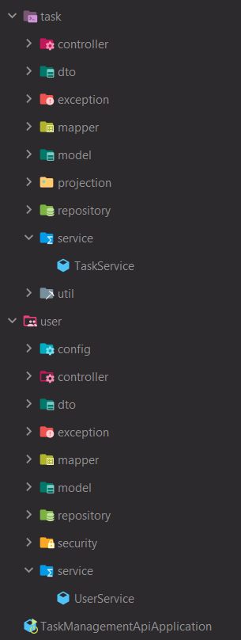
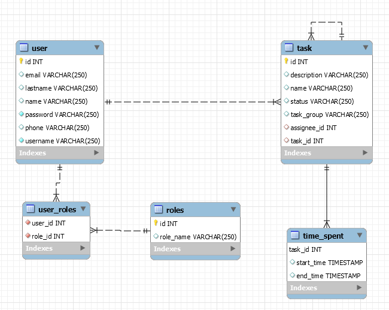

# 1. Introduction
This is a Spring made Task Management API Web Service. Main works include:

Branch "SpringDataRest" in project included Spring data rest implementation for CRUD operations. 
Used Spring framework data rest to support "Task Management API" search, listing, update, delete and more (dependency injection, inversion of control, REST API, etc.).
Implemented security workflow via in-memory H2 database and JWT authentication provided by Spring Security.
Utilized Hibernate, Spring JPA to provide better support of database operations.
# 2. Requirements
The technologies used in this app are as follows:

1. Spring Boot 2.5.5
2. Spring Data JPA 2.5.5
3. Spring Data Rest 2.5.5
4. Hibernate 5.4.32
5. H2 Database 2.14.2
6. Maven 3.8.1
7. Lombok 1.18.2
8. Java 1.8.0_251
9. Swagger 2.9.2
10. Json web token JWT: 0.11.2
11. Spring Security: 5.5.2
# Project Structure
Create the folders we'll need for implementing project. We'll have two main packages inside `debarz.taskmanagementapi` package.
This main packages are `task` and `user`. Each package have  own smaller packages according too functionality.
- `config` package: includes configuration classes.
- `controller` package: includes REST controllers. Spring RestController takes care of mapping request data 
to the defined request handler method.
- `dto` package: includes A Data Transfer Object classes. Is an object that is used to encapsulate data, 
and send it from one subsystem of an application to another.
- `exception` package: includes exception classes. It is for send message in response that object was not found in database. 
- `mapper` package: includes mapper classes. It is for map entity to dto or vice versa.
- `model` package: includes entities classes. Entity class is a POJO (Plain Old Java Object) class, i.e. an ordinary 
class that is marked (annotated) as having the ability to represent objects in the database.
- `projection` package: includes projection interfaces for projecting only a selected fields from an entity representation. 
- `repository` package: includes repository interfaces that extends JPA repository. it contains API 
for basic CRUD operations and also API for pagination and sorting.
- `service` package: includes services classes, it is app functionality classes.
- `security` package: includes security classes. These classes implement functionality of app security     
  
- 

# Data Model of App
The following diagram is the Entity Relationship Diagram of the app design:

- User can have many roles. Ordinary role it 'user', but user can have 'user', 'admin' and more implemented roles.
- User can have many tasks, task can have many sub-tasks.
- Task table have @OneToMany recursive relation with self for creating sub_tasks and @OneToOne relation with TimeSpent table.
- Later improvement: group table, relation @OneToMany with User table. User can belong group that can create group tasks.

# Installation
Running the Application Run Spring boot:
1. `mvn clean spring-boot:run`
2. Security details example: 
- `username: user1`
- `password: user`
- Authorization: `baerer token`
3. JSON example for testing purpose:
```
   {
     "username": "user1",
     "password": "user"
   }
```
4. For security disable use:
- In the TaskManagementApiApplication.class annotation @SpringBootApplication(exclude = { SecurityAutoConfiguration.class }) 
5. Documentation API (Swagger) by accessing
- `http://localhost:8080/swagger-ui.html`
# H2 Console
- `http://localhost:8080/h2`  
- `jdbc:h2:mem:taskApp`
- username: `user`
- password: `password`
# Later App Improvement
- Implement `RestTample` to consume REST API
- -Navigating hypermedia APIs with Traverson
